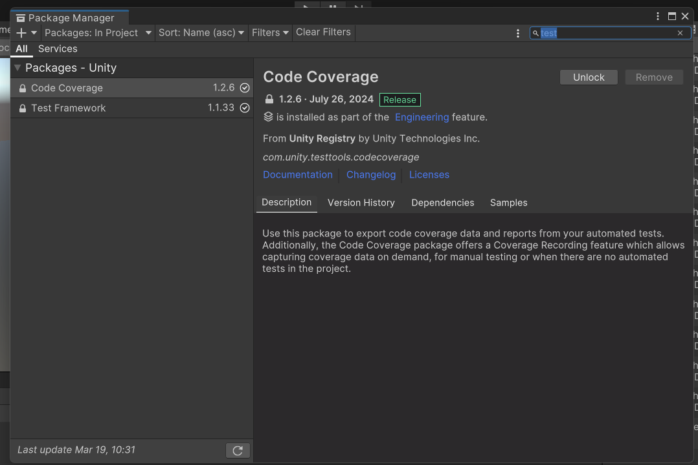

# 测试驱动开发 (TDD) 案例
## 概述

使用 Superpowers 的 `test-driven-development` skill 进行测试驱动开发。

这里基于unity-test-framework框架.

## 安装unity-test-framework
window->package manager



这两个包要能安装上，有可能自带了，也可能要增加安装。


## 对话流程

```
使用 superpowers 工作流，我要实现 [功能描述]，请使用 TDD 方式开发
```

之后的头脑风暴之类的流程参考 [直接创建Demo项目](Tutorial-1/Examples/直接创建Demo项目.md)

## 关键点

这里关键点，和其他的不同。这里会引入一个*Red-Green-Refactor*方式迭代开发。
先写失败测试，代码开发完成后通过测试，然后重构
