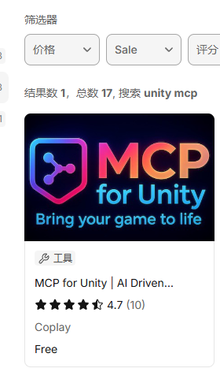
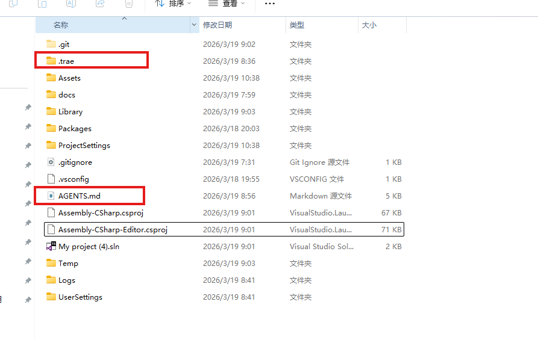

# 直接创建 Demo 项目

## 新建 Unity 项目

Unity 新建 3D 项目（2D 也可以）。

---

## MCP 配置

详细安装说明参考：https://github.com/CoplayDev/unity-mcp

### 步骤 1：安装 Python

下载地址：https://www.python.org/downloads/

直接下载最新版，注意必须 **3.10 以上（不包括 3.10）**。

具体步骤直接看这个教程：https://blog.csdn.net/sensen_kiss/article/details/141940274

> 已安装 Python 的可跳过。

### 步骤 2：安装 uv

打开 PowerShell（开始菜单搜索 `powershell`）：


执行以下命令：

```powershell
powershell -ExecutionPolicy ByPass -c "irm https://astral.sh/uv/install.ps1 | iex"
```

> PowerShell 粘贴使用 `Ctrl+Shift+V`，最后按 `Enter` 执行。

### 步骤 3：安装 MCP

安装方式有两种：

**方式一：通过 Git URL 安装**

在 Unity 中：`Window > Package Manager > + > Add package from git URL...`

```
https://github.com/CoplayDev/unity-mcp.git?path=/MCPForUnity#main
```

**方式二：Unity Asset Store**



> Unity Asset Store 版本会落后一些。

### 步骤 4：开启 MCP

依次点击菜单项开启 MCP：


> 之后会启动一个网络监听进程，不要关闭，最小化即可。


### 常见问题

**问题一：使用的是 Asset Store 旧版 MCP**

需先选择 Local 模式：


**问题二：点击 Start Server 运行不起来**

点击 Manual Server Launch 旁边的三角形，手动开启 MCP 服务器：


复制框内内容到 PowerShell，按 Enter 执行：


---

## 复制配置文件到项目

将本项目 `TraeConfigs/ProjectConfigs` 中的 `.trae` 文件夹和 `AGENTS.md` 复制到 Unity 项目根目录：



---

## 打开 Trae 并进入项目文件夹

详细步骤参考 [游戏策划案例](../Trae安装+策划文档生成.md)。

---

## 开启 Trae 中的 MCP 开关

在 IDE 模式中，打开右上角的设置：


选择 MCP：


以下两种方式选其一：

**方式一：启用项目级 MCP**

先确保 `.trae` 配置文件夹下面有 `mcp.json` 文件：


然后开启"启用项目级 MCP"：


在 unityMCP 旁边点启动：


**方式二：在 Trae 编辑器里面手动添加**


复制以下内容到里面，再确认：


```json
{
  "mcpServers": {
    "unityMCP": {
      "url": "http://localhost:8080/mcp"
    }
  }
}
```

### 检查 MCP 连接

最后检查 MCP 是否连接上。（**注意：需要保证 Unity 先开启 MCP，然后打开 Trae，顺序不能反**）

点击 `@`，选择 "build with mcp" 模式，如果右边亮绿灯就是连上了：


---

## Trae 对话流程

先进入 SOLO 模式，然后开始后面的对话步骤。

**模型推荐选择：GML-5**

### 步骤 1：输入提示词

```
严格使用 superpowers 工作流，balabala
```


接下来进入 brainstorming（头脑风暴）阶段，回答 AI 的问题。

### 步骤 2：确认设计文档


可在此指出问题，或说"用 game-development 优化一下方案"。

### 步骤 3：选择开发方式

AI 会自动生成计划文档，然后让你选择开发方式：


两种方式都可以：

- **第一种**：直接在当前窗口执行
- **第二种**：新开窗口执行

### 步骤 4：等待完成

之后是较长时间的等待，AI 会自动生成内容、控制编辑器等。

> 中间可以打断干预，有时 AI 会犯错并绕圈子。

完成后自行测试，如有 Bug 参考 [修复 Bug](修复Bug.md)。