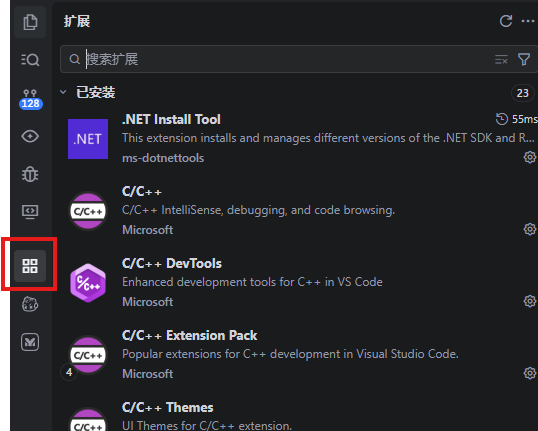

# Trae 安装 + 策划文档生成

Trae 的基本使用参考官方文档即可：https://docs.trae.ai/

---

## 1. 安装 Trae

官网下载安装国内版：https://www.trae.cn/

> 有 VS Code 的话，打开时建议同步 VS Code 配置。

---

## 2. 修改配置

### 2.1 基础配置

**步骤 1：创建项目文件夹**

IDE 以文件夹为单位运行，需要先创建工作目录。

**步骤 2：打开 Trae，选择项目文件夹**

**步骤 3：安装扩展插件**

### 2.2 项目配置

**步骤 1：复制配置文件**

将本项目 `TraeConfigs/ProjectConfigs` 中的内容复制到 Trae 项目文件夹下

**步骤 2：检查模型可用性**

**模型推荐：**
高峰期，不排队：minimax(速度最快)，qwen3.5-plus/doubao-seed/kimi-k2.5(有图片理解)
低峰期，最好用的模型：glm5.1(推理最强)，minimax(速度最快), qwen3.6-plus/glm-turbo/kimi-2.6（有图片理解）

**步骤 3：进入 Solo 模式**

---

## 3. 游戏设计示例

**步骤 1：输入提示词**

**步骤 2：等待加载，进入头脑风暴**

最终会生成一个 Markdown 格式的游戏设计文档。（对话太长时，可以直接说"生成文档"）

> 生成完设计文档后，如果 AI 继续写实现方案，可以停止对话。